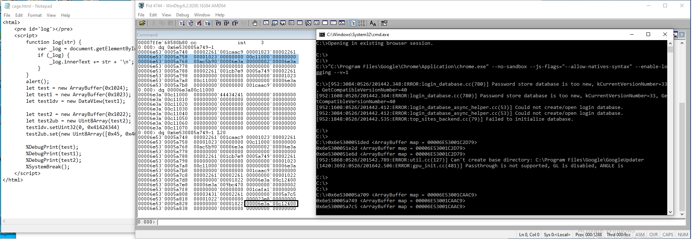
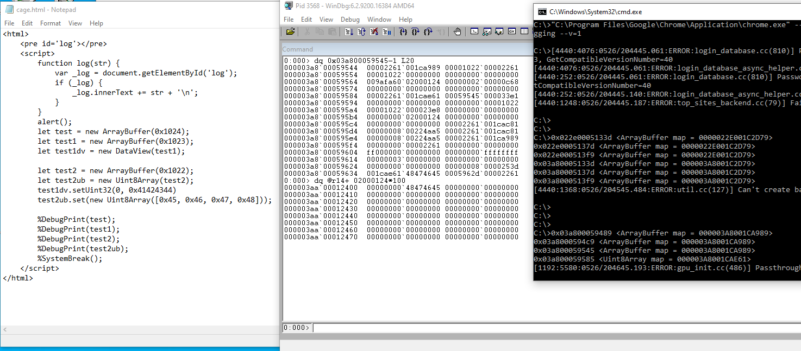

# JavaScript Overview

How does javascript work?

```
code -> token -> ast -> bytecode -> optimized code
``` 

- V8 handles parsing code into AST

- Ignition handles interpreting AST into Bytecode

- Sparkplug compiles Bytecode into non-optimized native code

- Turbofan optimised non-optimized native code

Some interesting stuff:

- [Understanding V8's Bytecode](https://medium.com/dailyjs/understanding-v8s-bytecode-317d46c94775)

- [V8 Binding Design](https://chromium.googlesource.com/chromium/src/+/master/third_party/blink/renderer/bindings/core/v8/V8BindingDesign.md)

- [V8 Inline Caching](https://javascript.plainenglish.io/v8-engine-and-inline-caching-in-javascript-fef80054a551)

# V8 Object Internals

Javascript types are dynamic, but how does this shit work if javascript is based on c++ which is statically typed? - Map a.k.a. Hidden Class (Shape)

Most objects are structured as so:

```
--------------
|     Map    |
--------------
| Properties |
--------------
|  Elements  |
--------------
```

Properties points to the values in the key-value pairs of object while Elements points to the values in an array/in an object (numbered properties) (both technically can function as backing stores). There are 2 kinds of properties:

1. Fast Properties

2. Slow/Dictionary Properties

# Pointer Tagging

- In v8, values represented as objects and allocated on the heap

- If we need to keep allocating on heap everytime we manipulate/create/delete object, that sucks

- Instead, store some of the values inline so that we dont have to keep using the heap

- Then how to differentiate object pointer from inline value? Pointer Tagging

# Pointer Compression

- Use 4 bytes instead of 8 bytes 

- MSB stored in r13

- Serve as some form of sandbox 

# Chrome Architecture

- V8: JavaScript Engine

- Blink: Renderer Engine

- Mojo: IPC between Browser and Renderer

- Renderer Sandbox: 1 tab = 1 renderer = 1 process (low privileges)

- Isolate: a running instance of a V8 engine (like a thread to a process?). 1 thread is allocated 1 isolate object

- Context: global scope for variables, allows differentiating of variables belonging to 1 window from another

# Blink

- Renderer Engine, forked from WebKit

- [Uses various allocators](https://chromium.googlesource.com/chromium/src/+/0e94f26e8/third_party/WebKit/Source/wtf/Allocator.md)

# Building V8 from scratch

https://jhalon.github.io/chrome-browser-exploitation-3/

https://gist.github.com/jhalon/5cbaab99dccadbf8e783921358020159

https://medium.com/angular-in-depth/how-to-build-v8-on-windows-and-not-go-mad-6347c69aacd4

https://chromium-review.googlesource.com/c/v8/v8/+/1382738

https://chromium-review.googlesource.com/c/chromium/src/+/1962898/1/build/toolchain/win/tool_wrapper.py#21

# Debugging Things

```
d8.exe --allow-natives-syntax --trace-opt
bp v8!v8::internal::Runtime_DebugPrint
"C:\Users\kali\AppData\Local\Google\Chrome\Application\chrome.exe" --no-sandbox --js-flags="--allow-natives-syntax" --enable-logging --v=1
"C:\Program Files\Google\Chrome\Application\chrome.exe" --no-sandbox --js-flags="--allow-natives-syntax" --enable-logging --v=1
```

# Utilities

https://resource.heltec.cn/utils/hf

https://gregstoll.com/~gregstoll/floattohex/

[LINUX - gdb macro `job`](https://stackoverflow.com/questions/58433681/i-want-to-use-job-command-in-v8-release-so-how-can-i-do-it-or-just-by-pass-th)

# Current state of Chrome Exploitation (V8 Type Confusion/OOB-Writes?)

### Objective:

```
Bug -> Primatives -> RWX -> RCE 
```

### RCE:

Prior to "Early 2018" (as per [phrack](http://www.phrack.org/issues/70/9.html))

- JIT functions are RWX

- We can JIT a function to create RWX space, before using our primatives to write shellcode and obtain RCE (ezpz)

- [Mitigation: R-X/RW-X](https://github.com/v8/v8/commit/14917b6531596d33590edb109ec14f6ca9b95536) (a.k.a [W^X](https://en.wikipedia.org/wiki/W%5EX))

    > Bypass #1: Bitmap flip FLAG_write_protect_code_memory via leaking V8 Isolate - need relative R/W, [see](https://tiszka.com/blog/CVE_2021_21225_exploit.html)

Prior to TPT

- Abuse WASM spaces which are RWX

- [Mitigation: kWebAssemblyCodeProtectionPku (Protects RWX WASM from being written)](https://starlabs.sg/blog/2022/12-the-hole-new-world-how-a-small-leak-will-sink-a-great-browser-cve-2021-38003/)

    > Bypass #1: Bitmap flip FLAG_write_protect_code_memory via OfflineAudioContext (set to 0) - need Arbitrary R/W, [see](https://tiszka.com/blog/CVE_2021_21225_exploit.html)

Prior to CPT

- JIT "Shellcoding"?

- Even though JIT code are R-X, we can spray an array of functions such as `const jit = () => { return [1.1, 2.2, 3.3, 4.4] }`

- Each float is 64 bits and we can "hide" shellcode in the floats before "jumping" from float to float in order to get a full RCE

- [Mitigation: CPT](https://docs.google.com/document/d/1CPs5PutbnmI-c5g7e_Td9CNGh5BvpLleKCqUnqmD82k/edit )

### Obtaining Arbitrary R/W

Prior to Chrome 80 as per [gpz](https://googleprojectzero.blogspot.com/2021/01/in-wild-series-chrome-exploits.html)

- Pointer Compression NOT used

- No V8 "sandbox" (pointer compression is not really a proper sandbox but it does ensure that if you write a backing store in a form of a compressed pointer such as the element or property pointers, your primatives can only work in the V8 heap space)

- We can easily obtain arbitrary r/w (ezpz)

Prior to ArrayBuffer sandboxing (Ubercage)

- In order to obtain arbitrary r/w, we need to be able to control raw pointers. A commonly abused raw pointer is backing stores in ArrayBuffer objects

- We can escalate sandboxed/compressed r/w into arbitrary r/w by reading and writing 64 bits into the compressed heap space of V8. If we have an OOB object, we can possibly abuse it to write to raw pointers as well (just like how we can write compressed pointers)

- [Mitigation: Sandboxifying BackingStores of ArrayBuffer objects](https://docs.google.com/document/d/1HSap8-J3HcrZvT7-5NsbYWcjfc0BVoops5TDHZNsnko/edit)

    > Bypass: JIT Shellcoding + Arbitrary R/W via TypedArrays (must be before CPT) [Technique #1 used in DiceCTF](https://anvbis.au/posts/code-execution-in-chromiums-v8-heap-sandbox/), [Another technique #1 used in DiceCTF](https://mem2019.github.io/jekyll/update/2022/02/06/DiceCTF-Memory-Hole.html)

    > Bypass: WASM imported_mutable_global raw pointer [Technique #2 used in DiceCTF](https://blog.kylebot.net/2022/02/06/DiceCTF-2022-memory-hole/), [Another technique #2 used in DiceCTF](https://anvbis.au/posts/exploring-historical-v8-heap-sandbox-escapes-i/)

    > Bypass: Somehow leak [@r14](https://source.chromium.org/chromium/chromium/src/+/main:v8/src/codegen/x64/register-x64.h;l=239;drc=73b9a84755562357a94135b952f492d8c631410f) and add it to the **index** after applying the shifts. **Index** for ArrayBuffer object can be obtain via Sandbox read primative (Have not seen technique yet but maybe it's possible?)

# Current state of Chrome Exploitation (V8 UaF)

CVE-2019-5786

- https://blog.exodusintel.com/2019/03/20/cve-2019-5786-analysis-and-exploitation/

WebAudio CVE-2020-6449 

- https://www.anquanke.com/post/id/221043

- https://packetstormsecurity.com/files/172843/Chrome-WebAudio-Use-After-Free.html

- https://securitylab.github.com/research/CVE-2020-6449-exploit-chrome-uaf/ 

CVE-2021-37975

- https://googleprojectzero.github.io/0days-in-the-wild//0day-RCAs/2021/CVE-2021-37975.html

- https://securitylab.github.com/research/in_the_wild_chrome_cve_2021_37975/ 

CVE-2019-13720

- https://www.exploit-db.com/exploits/50917

# Ubercage SBX

https://blog.theori.io/a-deep-dive-into-v8-sandbox-escape-technique-used-in-in-the-wild-exploit-d5dcf30681d4

https://retr0.zip/blog/abusing-Liftoff-assembly-and-efficiently-escaping-from-sbx.html

https://medium.com/@numencyberlabs/use-wasm-to-bypass-latest-chrome-v8sbx-again-639c4c05b157

https://medium.com/@numencyberlabs/use-native-pointer-of-function-to-bypass-the-latest-chrome-v8-sandbox-exp-of-issue1378239-251d9c5b0d14

- Ubercage seems to be implemented from Chrome 103 and onwards for Windows platforms

    
    *Chrome 102.0.5005.63 (Last apprent version of Chrome before ArrayBuffer Backing Store were sandboxed)*

    
    *Chrome 104.0.5112.81*

# Browser SBX

- [Renderer RCE -> Enable Mojo -> Browser Heap Spray + Browser UaF -> Fake Structures -> Fake VTables -> Browser RCE](https://googleprojectzero.blogspot.com/2019/04/virtually-unlimited-memory-escaping.html)

- [Renderer RCE -> Enable Mojo -> No-Sandbox Renderer RCE](https://blog.theori.io/cleanly-escaping-the-chrome-sandbox-1c38abd3c9cb)

# Some good stuff

- [Tiggering GCs in V8, Exploit stablization techniques (Chrome 90.0.4430.72)](https://tiszka.com/blog/CVE_2021_21225_exploit.html)